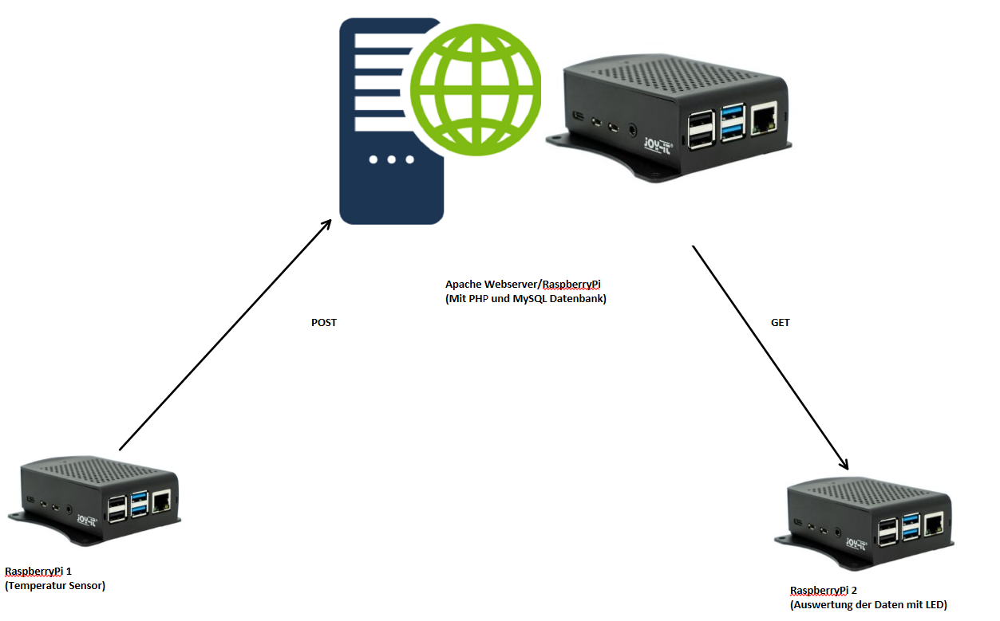

# RaspberryPiREST
Skripte zum Senden und Empfangen der Daten mit dem Raspberry Pi unter [https://github.com/Dubsteet/RaspberryPiTempCom](https://github.com/Dubsteet/RaspberryPiTempComf)

## Topologie

Anzeigen

## Installation
### Folge den Schritten im [PDF Dokument](RaspberryPi%20REST-Webserver.pdf) um folgendes zu installieren:
- Apache Webserver mit PHP
- MySQL Datenbank

## Datenbank mit PHP verbinden
*[dbConfigSample.php](dbConfigSample.php)* kopieren und in `dbConfig.php` umbenennen.

### In der *dbConfig.php* folgende Felder ausfüllen:

`DB_HOST` ist die ip der Datenbank und kann mit `localhost` ausgefüllt werden.

`DB_USER` ist der zuvor erstellte Datenbank Benutzer.

`DB_PASS` ist das Passwort vom Datenbank Benutzer.

`DB_NAME` ist der zuvor erstellte Datenbank Name.

`DB_TABLE` ist die datenbank tabelle mit den messungen

## REST-API
HTTP-POST = Daten senden und erstellen eines neuen Datenbank Eintrags

HTTP-GET = Daten bekommen

- GET und POST Requests können gesendet werden.
- Filterparameter und Datensätze werden per URL-Parameter übertragen.
- Gibt die Daten im JSON Format zurück.

### Requests
Bsp. POST-Request: http://localhost/index.php?temp=22.1&room=3.11

Bsp. GET-Request:  http://localhost/index.php?id=12

### Verfügbare URL-Parameter:
- `id`
- `temp`
- `room`
- `timestamp`
- `totalentrycount`

### Notwendige URL-Parameter für die POST Request:
- `temp`
- `room`
